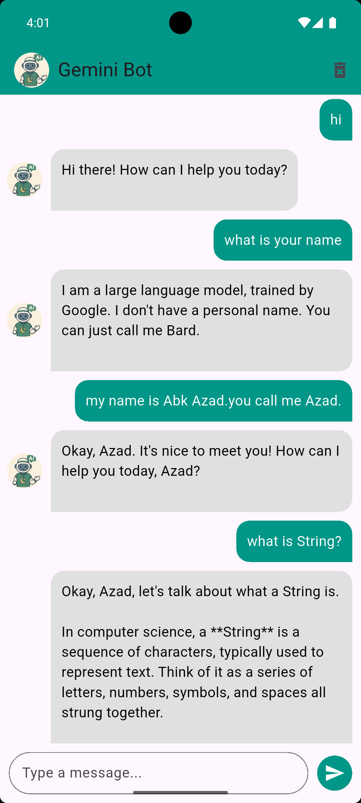

# chat_bot_app

## How I Built It

I followed a step-by-step development workflow to build this app from scratch:

- Initialized a Flutter project using `flutter create chat_bot_app`.
- Designed a clean chat interface using `ListView.builder` and `TextField`.
- Used `SharedPreferences` to store and load chat history locally.
- Integrated the Gemini API (`gemini-2.0-flash`) via HTTP POST using the `http` package.
- Converted messages to Gemini's required format with roles (`user` and `model`).
- Displayed bot replies and user messages with distinct styling.
- Implemented message persistence across app sessions.
- Added a clear chat button using `IconButton`.
- Managed user input and message list using `StatefulWidget`.

